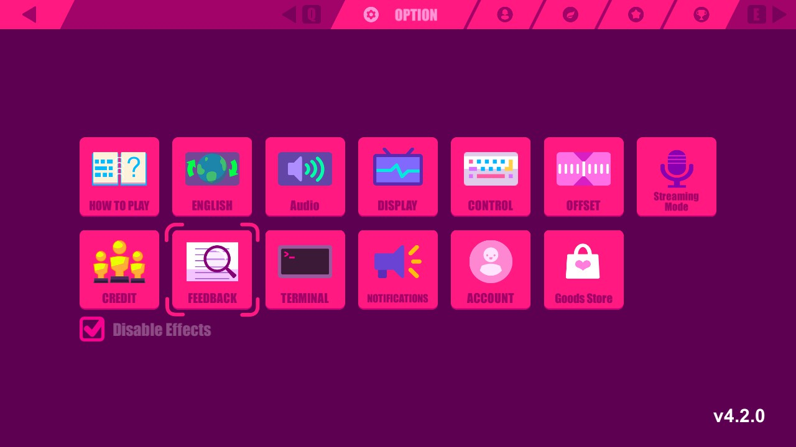

# SelectiveEffects
Mod that allows disabling battle effects.

## Features
* Individual config options for several effects.
* Enable/disable toggle at the menu.

## Settings
The config file can be found at `${Your muse dash folder}/UserData/SelectiveEffects.cfg`
### Main
* `Enabled` stores the last status of the toggle.
* `DisableAllEfects` uses a general method to disable all effects in battle.
### Judgement
* `DisableJudgement` disables the judgements (including early/late).
* `MakeJudgementSmaller` if the judgements are available, it makes them 25%~ smaller.
### Hit
* `DisableHitDissapearAnimation` disables the enemies animation when they have been hit and makes them disappear inmmeadiatly.
* `DisableHitEffects` disables the hit effects and particles.
* `DisableGirlHitFx` the same as `DisableHitEffects` but doesn't disappear the out_fx of some enemies.
* `DisablePressFx` disables some particles when pressing the holds.
### MusicHearts
* `DisableMusicNotesFx` disables the particles and text that appear when you touch a music note.
* `DisableHeartsFx` disables the particles and text that appear when you touch a heart.
### Misc
* `DisableBossFx` disables some effects the boss has when deploying enemies.
* `DisableDustFx` disables the dust effect when the character falls to the ground.
* `DisableHurtFx` disables the text that appear when the character is hurt.

It is prefered to use the `DisableAllEfects` option instead of the individual options.

## In-game screenshots
### Menu Toggle
